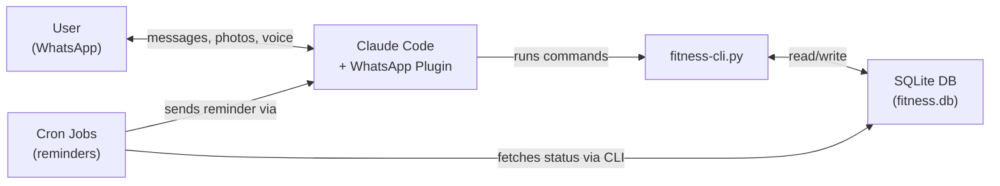
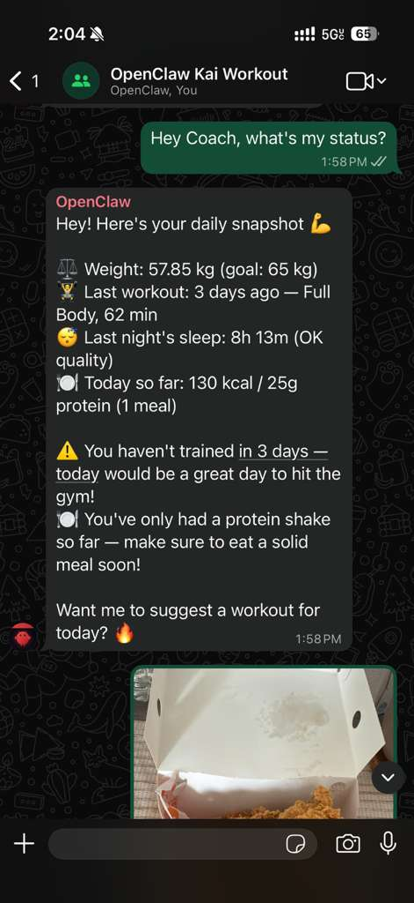
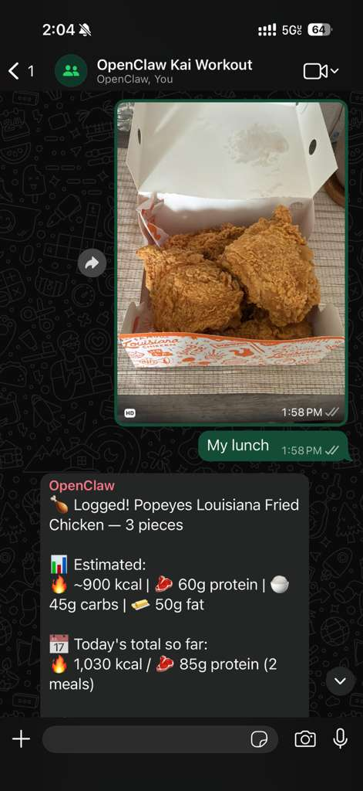
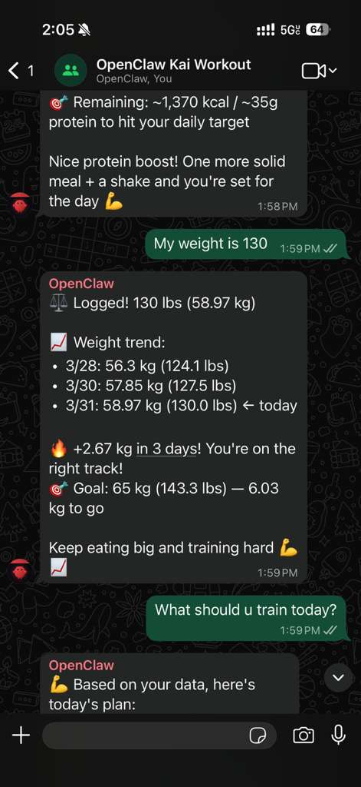
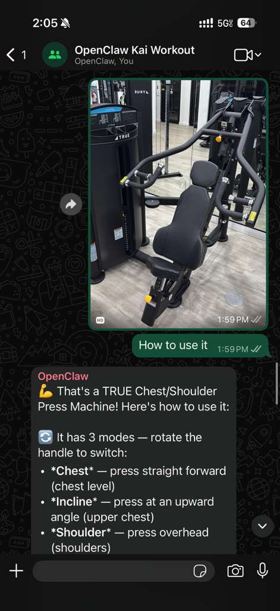
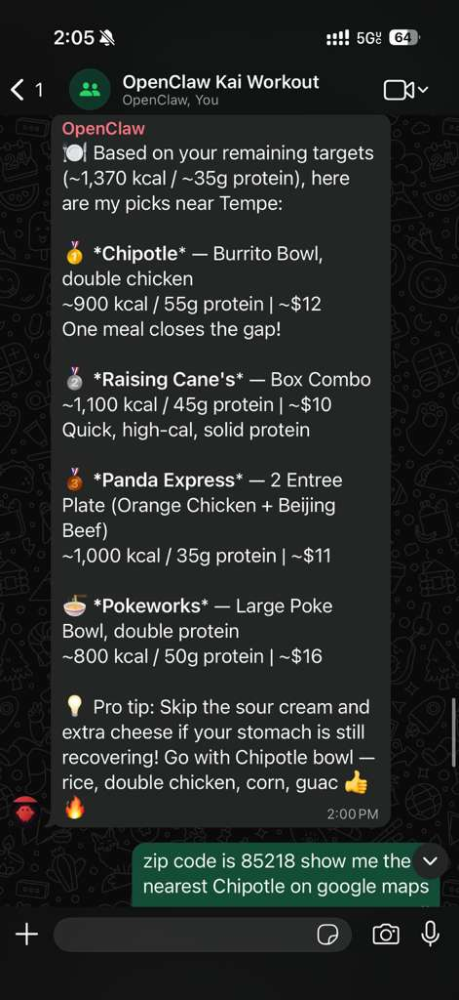

# AI Fitness Coach

[](LICENSE)
[](https://www.python.org/downloads/)
[](https://docs.anthropic.com/en/docs/claude-code)

**Your AI personal trainer that lives in WhatsApp.** Track workouts, nutrition, sleep, and weight -- then get smart suggestions, personalized reminders, and accountability, all through chat.

> After setup, everything happens in WhatsApp. Change goals, set reminders, track food -- all through chat.

---

## Features

- **Soul System** -- Customize the coach's personality, tone, and behavior via a simple config file
- **Voice Messages** -- Send voice notes in WhatsApp; transcribed via Whisper and understood by the coach
- **Photo Recognition** -- Snap a photo of your meal; Claude Vision estimates calories and macros automatically
- **Multi-Language** -- Works in any language you chat in (English, Chinese, Spanish, etc.)
- **Smart Workout Suggestions** -- AI picks exercises based on what you haven't trained recently, adjusted for your sleep quality
- **Nutrition Tracking** -- Log meals by description or photo; track calories, protein, carbs, and fat
- **Sleep Tracking** -- Log sleep times and quality; affects workout intensity recommendations
- **Progressive Overload** -- Track weight/sets/reps per exercise and see strength trends over time
- **Cron Reminders** -- Automated WhatsApp messages that check your data and send context-aware nudges (morning and evening)
- **Exercise Database** -- 70+ exercises categorized by muscle group and equipment type

---

## How It Works



1. You send a message to your WhatsApp group (text, photo, or voice)
2. Claude Code (with the WhatsApp plugin) receives and interprets the message
3. The coach personality (defined in your group config) processes it -- estimating macros, understanding workout reports, etc.
4. `fitness-cli.py` logs data to or queries from the local SQLite database
5. Claude formats the response into a friendly WhatsApp reply
6. Cron jobs run twice daily, fetch your status, and send personalized reminders

---

## Quick Start

### 1. Install Claude Code

```bash
npm install -g @anthropic-ai/claude-code
claude --version
```

### 2. Install the WhatsApp Plugin

> **Plugin repo:** [Rich627/whatsapp-claude-plugin](https://github.com/Rich627/whatsapp-claude-plugin) — WhatsApp channel plugin for Claude Code

```bash
# Inside a Claude Code session:
/plugin install whatsapp@whatsapp-claude-plugin
```

### 3. Clone and Set Up

```bash
git clone https://github.com/moltbot0912/ai-fitness-coach.git
cd ai-fitness-coach
chmod +x setup.sh
./setup.sh
```

### 4. Start Chatting

```bash
claude --channels plugin:whatsapp@whatsapp-claude-plugin
```

Send a message in your WhatsApp group and the coach will respond. For detailed setup instructions, see [docs/SETUP.md](docs/SETUP.md) and [docs/CLAUDE_CODE_SETUP.md](docs/CLAUDE_CODE_SETUP.md).

---

## Demo

Here is what a typical interaction looks like in your WhatsApp group:

### Daily Status Check

> "Hey Coach, what's my status?" -- Get a complete daily snapshot with weight, workout, sleep, and nutrition at a glance.

<p align="center">
  
</p>

### Food Photo Recognition

> Snap a photo of your meal and the coach instantly analyzes calories and macros, then updates your daily totals.

<p align="center">
  
</p>

### Smart Workout Plan

> "What should I train today?" -- The AI builds a personalized workout based on your sleep quality, training history, and available equipment.

<p align="center">
  
</p>

### Gym Equipment Recognition

> Snap a photo of any gym machine and the coach identifies it, then teaches you how to use it with proper form.

<p align="center">
  
</p>

### Personalized Restaurant Recommendations

> "Any restaurant recommendations?" -- Get suggestions tailored to your remaining calorie and protein targets for the day.

<p align="center">
  
</p>

---

## FAQ

### Do I need a paid API key?

Yes. Claude Code requires an Anthropic API subscription or a Claude Pro/Team plan. The AI Fitness Coach project itself is free and open source, but the underlying Claude Code CLI requires authentication and API credits.

### Can I use this without WhatsApp?

Yes. The CLI (`fitness-cli.py`) works entirely standalone. You can log food, workouts, sleep, and weight directly from the terminal. The WhatsApp integration is optional and adds the conversational interface and automated reminders.

### Where is my data stored?

All data is stored locally in a SQLite database file (`data/fitness.db`). Nothing is sent to external servers beyond the Claude API calls for generating responses. Your fitness data stays on your machine.

### How accurate are the AI macro estimates?

The coach uses Claude's general knowledge to estimate macros from food descriptions and photos. The estimates are reasonable approximations but not lab-precise. For more accuracy, provide specific quantities (e.g., "200g chicken breast" instead of "some chicken"). You can always override by providing exact macro values.

### How do I back up my data?

Copy the `data/fitness.db` file. That single file contains all your workouts, nutrition logs, weight history, and sleep data. See [docs/AWS_SETUP.md](docs/AWS_SETUP.md) for automated backup instructions.

### Can multiple people use the same instance?

Currently, the system is designed for a single user per installation. Each person should have their own profile and database. Multiple people in the same WhatsApp group will share a single bot, but data tracking is per-installation.

---

## Limitations and Warnings

Before using AI Fitness Coach, please be aware of the following:

- **Requires Anthropic API key** -- Claude Code requires an active Claude Pro, Team, or Enterprise subscription, or API credits. This is a recurring cost.
- **Requires an always-on machine** -- For WhatsApp integration and cron reminders, you need a machine that stays running (your computer or a cloud VM at ~$3-5/month). See [docs/AWS_SETUP.md](docs/AWS_SETUP.md).
- **WhatsApp linked device limitations** -- The WhatsApp plugin links as an additional device to your account. WhatsApp allows a limited number of linked devices, and the link may need to be re-established periodically.
- **Nutrition estimates are approximations** -- AI-generated calorie and macro estimates are based on general knowledge, not certified nutritional databases. They are useful for tracking trends but should not be treated as exact values.
- **Not a substitute for professional advice** -- This tool is not a replacement for professional medical, nutritional, or fitness advice. Consult a qualified professional before starting any new exercise or diet program.
- **Voice transcription accuracy varies** -- Voice message transcription (via Whisper) works best in quiet environments. Background noise, accents, and uncommon terminology may reduce accuracy.

---

## Supported Platforms

| Platform | Status |
|---|---|
| **macOS** | Fully supported |
| **Linux** (Ubuntu/Debian) | Fully supported |

---

## For Developers

### Architecture

The system is built around a Python CLI (`fitness-cli.py`) backed by a SQLite database, orchestrated by Claude Code with a WhatsApp channel plugin. The coach personality is defined in a group config file (the "soul" system).

For the full architecture overview, component details, database schema, and data flow diagrams, see [docs/ARCHITECTURE.md](docs/ARCHITECTURE.md).

### CLI Reference

All fitness operations are exposed via `python3 src/fitness-cli.py <command>`. Commands include logging (food, weight, workouts, sleep, exercises), querying (status, summaries, trends), and smart features (workout suggestions, weekly plans, strength trends).

For the full command reference with arguments and example output, see [docs/COMMANDS.md](docs/COMMANDS.md).

### Development Setup

```bash
# Clone and set up
git clone https://github.com/moltbot0912/ai-fitness-coach.git
cd ai-fitness-coach
./setup.sh

# Run the CLI
python3 src/fitness-cli.py --help

# Run tests
python3 -m pytest tests/
```

See [CONTRIBUTING.md](CONTRIBUTING.md) for code conventions, contribution guidelines, and ideas for new features.

### Project Structure

```
ai-fitness-coach/
  src/
    fitness-cli.py             # Main CLI for all fitness operations
    db_manager.py              # SQLite database layer
    exercises.md               # Exercise database (70+ exercises)
  config/
    .env.example               # Environment variable template
    profile.example.json       # User profile template
    group-config.example.md    # WhatsApp group personality template
  cron/
    workout-reminder.sh        # Automated WhatsApp reminder script
    install-cron.sh            # Cron job installer
  docs/
    ARCHITECTURE.md            # System architecture overview
    AWS_SETUP.md               # Cloud deployment guide
    COMMANDS.md                # CLI command reference
    SETUP.md                   # General setup guide
    CLAUDE_CODE_SETUP.md       # Claude Code + WhatsApp plugin guide
  data/                        # SQLite database (git-ignored)
  setup.sh                     # One-click setup script
  CONTRIBUTING.md              # Contribution guidelines
  LICENSE                      # MIT License
```

---

## License

MIT License. See [LICENSE](LICENSE).
