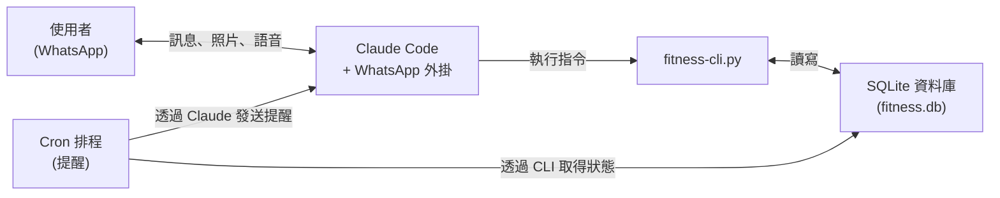

# AI Fitness Coach

[](LICENSE)
[](https://www.python.org/downloads/)
[](https://docs.anthropic.com/en/docs/claude-code)

**住在 WhatsApp 裡的 AI 私人教練。** 追蹤運動、營養、睡眠和體重，然後獲得智慧建議、個人化提醒和督促，全部透過聊天完成。

> 設定完成後，一切都在 WhatsApp 裡進行。更改目標、設定提醒、追蹤飲食 -- 全部透過聊天。

---

## 功能特色

- **靈魂系統** -- 透過簡單的設定檔自訂教練的個性、語氣和行為
- **語音訊息** -- 在 WhatsApp 傳送語音；透過 Whisper 轉錄並由教練理解
- **照片辨識** -- 拍一張餐點照片；Claude Vision 自動估算卡路里和巨量營養素
- **多語言** -- 支援任何聊天語言（中文、英文、西班牙文等）
- **智慧運動建議** -- AI 根據你最近沒練到的肌群選擇動作，並依據睡眠品質調整強度
- **營養追蹤** -- 透過描述或照片記錄餐點；追蹤卡路里、蛋白質、碳水化合物和脂肪
- **睡眠追蹤** -- 記錄睡眠時間與品質；影響運動強度建議
- **漸進式超負荷** -- 追蹤每個動作的重量/組數/次數，查看力量趨勢
- **Cron 提醒** -- 自動的 WhatsApp 訊息，檢查你的數據後發送情境感知的提醒（早晚各一次）
- **動作資料庫** -- 70+ 個動作，按肌群和器材分類

---

## 運作方式



1. 你在 WhatsApp 群組傳送訊息（文字、照片或語音）
2. Claude Code（搭配 WhatsApp 外掛）接收並解讀訊息
3. 教練個性（定義在群組設定檔中）處理訊息 -- 估算巨量營養素、理解運動報告等
4. `fitness-cli.py` 將數據記錄到本地 SQLite 資料庫或從中查詢
5. Claude 將回應格式化為友善的 WhatsApp 回覆
6. Cron 排程每天執行兩次，取得你的狀態，發送個人化提醒

---

## 快速開始

### 1. 安裝 Claude Code

```bash
npm install -g @anthropic-ai/claude-code
claude --version
```

### 2. 安裝 WhatsApp 外掛

> **外掛 repo:** [Rich627/whatsapp-claude-plugin](https://github.com/Rich627/whatsapp-claude-plugin) — Claude Code 的 WhatsApp 頻道外掛

```bash
# 在 Claude Code 工作階段中：
/plugin install whatsapp@whatsapp-claude-plugin
```

### 3. 複製並設定

```bash
git clone https://github.com/moltbot0912/ai-fitness-coach.git
cd ai-fitness-coach
chmod +x setup.sh
./setup.sh
```

### 4. 開始聊天

```bash
claude --channels plugin:whatsapp@whatsapp-claude-plugin
```

在 WhatsApp 群組傳送訊息，教練就會回應。詳細設定說明請參閱 [docs/SETUP.md](docs/SETUP.md) 和 [docs/CLAUDE_CODE_SETUP.md](docs/CLAUDE_CODE_SETUP.md)。

---

## 使用示範

以下是 WhatsApp 群組中的典型互動：

### 餐點照片辨識

```
你：      [傳送一張烤雞胸肉飯配蔬菜的照片]

教練：    我看到烤雞胸肉配飯和綜合蔬菜！
          我的估算：
          - ~520 大卡 | 蛋白質 42g | 碳水 55g | 脂肪 12g

          今日累計：1,040 / 2,200 大卡 | 78 / 120g 蛋白質
          還剩大約 1,160 大卡 -- 晚點來杯蛋白奶昔
          幫助你達標？
```

### 運動建議

```
你：      今天練什麼？

教練：    根據你的紀錄，你已經 5 天沒練背了，
          肩膀也 4 天沒練。你最近睡眠不錯（平均 7.5 小時），
          所以可以加大訓練量。

          這是一個 40 分鐘的背 + 肩在家健身的計劃：

          熱身（5 分鐘）：
          - 手臂繞圈、彈力帶拉開

          背部（20 分鐘）：
          - 槓鈴划船：4 x 10 @ 中等重量
          - 啞鈴划船：3 x 12 每邊
          - 引體向上：3 x 最大次數

          肩膀（10 分鐘）：
          - 啞鈴肩推：3 x 10
          - 側平舉：3 x 15

          收操（5 分鐘）：
          - 伸展背闊肌、斜方肌、後三角肌
```

### 每日提醒

```
[上午 10:00 -- 自動早晨提醒]

教練：    早安！距離你上次運動（胸部，家裡健身房）已經
          過了 2 天。昨晚睡得怎麼樣？今天練背或腿
          是不錯的選擇 -- 說一聲我就幫你規劃！
```

---

## 常見問題

### 需要付費的 API 金鑰嗎？

需要。Claude Code 需要 Anthropic API 訂閱或 Claude Pro/Team 方案。AI Fitness Coach 本身是免費開源的，但底層的 Claude Code CLI 需要認證和 API 額度。

### 可以不用 WhatsApp 嗎？

可以。CLI（`fitness-cli.py`）可以完全獨立運作。你可以直接在終端機記錄飲食、運動、睡眠和體重。WhatsApp 整合是可選的，它增加了對話式介面和自動提醒功能。

### 我的數據存在哪裡？

所有數據都存在本地的 SQLite 資料庫檔案（`data/fitness.db`）。除了 Claude API 呼叫用於生成回應外，沒有任何數據傳送到外部伺服器。你的健身數據留在你的機器上。

### AI 的巨量營養素估算有多準確？

教練使用 Claude 的通用知識，從食物描述和照片來估算巨量營養素。估算是合理的近似值，但不是實驗室級的精確。要更準確，請提供具體數量（例如「200g 雞胸肉」而不是「一些雞肉」）。你也可以直接提供確切的營養素數值來覆蓋估算。

### 如何備份我的數據？

複製 `data/fitness.db` 檔案即可。這個檔案包含你所有的運動、營養記錄、體重歷史和睡眠數據。自動備份說明請參閱 [docs/AWS_SETUP.md](docs/AWS_SETUP.md)。

### 多人可以使用同一個安裝嗎？

目前系統設計為每個安裝一位使用者。每個人應該有自己的檔案和資料庫。同一個 WhatsApp 群組中的多人會共用一個機器人，但數據追蹤是按安裝的。

---

## 限制與警告

使用 AI Fitness Coach 之前，請注意以下事項：

- **需要 Anthropic API 金鑰** -- Claude Code 需要有效的 Claude Pro、Team 或 Enterprise 訂閱，或 API 額度。這是持續性費用。
- **需要常駐運行的機器** -- WhatsApp 整合和 cron 提醒需要一台持續運行的機器（你的電腦或每月約 $3-5 美元的雲端 VM）。請參閱 [docs/AWS_SETUP.md](docs/AWS_SETUP.md)。
- **WhatsApp 已連結裝置限制** -- WhatsApp 外掛以附加裝置的形式連結到你的帳號。WhatsApp 允許有限數量的已連結裝置，且連結可能需要定期重新建立。
- **營養估算為近似值** -- AI 生成的卡路里和巨量營養素估算基於通用知識，非認證營養資料庫。它們適合追蹤趨勢，但不應視為精確數值。
- **不能替代專業建議** -- 此工具不能替代專業的醫療、營養或健身建議。在開始任何新的運動或飲食計劃之前，請諮詢合格的專業人士。
- **語音轉錄準確度因環境而異** -- 語音訊息轉錄（透過 Whisper）在安靜環境中效果最佳。背景噪音、口音和不常見的術語可能降低準確度。

---

## 支援平台

| 平台 | 狀態 |
|---|---|
| **macOS** | 完整支援 |
| **Linux**（Ubuntu/Debian） | 完整支援 |

---

## 開發者專區

### 架構

系統以 Python CLI（`fitness-cli.py`）為核心，搭配 SQLite 資料庫，由 Claude Code 與 WhatsApp 頻道外掛協調運作。教練個性定義在群組設定檔中（「靈魂」系統）。

完整的架構總覽、元件詳情、資料庫結構和數據流程圖，請參閱 [docs/ARCHITECTURE.md](docs/ARCHITECTURE.md)。

### CLI 指令參考

所有健身操作透過 `python3 src/fitness-cli.py <command>` 執行。指令包括記錄（飲食、體重、運動、睡眠、動作）、查詢（狀態、摘要、趨勢）和智慧功能（運動建議、週計劃、力量趨勢）。

完整的指令參考、參數和範例輸出，請參閱 [docs/COMMANDS.md](docs/COMMANDS.md)。

### 開發環境設定

```bash
# 複製並設定
git clone https://github.com/moltbot0912/ai-fitness-coach.git
cd ai-fitness-coach
./setup.sh

# 執行 CLI
python3 src/fitness-cli.py --help

# 執行測試
python3 -m pytest tests/
```

程式碼規範、貢獻指南和新功能構想，請參閱 [CONTRIBUTING.md](CONTRIBUTING.md)。

### 專案結構

```
ai-fitness-coach/
  src/
    fitness-cli.py             # 主要 CLI，所有健身操作
    db_manager.py              # SQLite 資料庫層
    exercises.md               # 動作資料庫（70+ 個動作）
  config/
    .env.example               # 環境變數範本
    profile.example.json       # 使用者檔案範本
    group-config.example.md    # WhatsApp 群組個性範本
  cron/
    workout-reminder.sh        # 自動 WhatsApp 提醒腳本
    install-cron.sh            # Cron 排程安裝程式
  docs/
    ARCHITECTURE.md            # 系統架構總覽
    AWS_SETUP.md               # 雲端部署指南
    COMMANDS.md                # CLI 指令參考
    SETUP.md                   # 一般設定指南
    CLAUDE_CODE_SETUP.md       # Claude Code + WhatsApp 外掛指南
  data/                        # SQLite 資料庫（git-ignored）
  setup.sh                     # 一鍵設定腳本
  CONTRIBUTING.md              # 貢獻指南
  LICENSE                      # MIT 授權
```

---

## 授權

MIT License。詳見 [LICENSE](LICENSE)。
